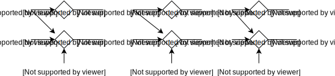

Recurrent neural networks
=========================

.. warning::

    This section is very much work in progress!

This tutorial explains recurrent bricks in Blocks. Readers unfamiliar with
bricks should start with the :doc:`bricks overview <bricks_overview>` first
and continue with this tutorial afterwards.

Quickstart example
------------------

As a starting example, we'll be building an RNN which accumulates the input it
receives. The equation describing that RNN is

.. math:: \mathbf{h}_t = \mathbf{h}_{t-1} + \mathbf{x}_t

>>> import numpy
>>> import theano
>>> from theano import tensor
>>> from blocks import initialization
>>> from blocks.bricks import Identity
>>> from blocks.bricks.recurrent import SimpleRecurrent
>>> x = tensor.tensor3('x')
>>> rnn = SimpleRecurrent(
...     dim=3, activation=Identity(), weights_init=initialization.Identity())
>>> rnn.initialize()
>>> h = rnn.apply(x)
>>> f = theano.function([x], h)
>>> print f(numpy.ones((3, 2, 3))) # doctest: +ELLIPSIS
[[[ 1.  1.  1.]
  [ 1.  1.  1.]]
<BLANKLINE>
 [[ 2.  2.  2.]
  [ 2.  2.  2.]]
<BLANKLINE>
 [[ 3.  3.  3.]
  [ 3.  3.  3.]]]...

Let's modify that example so that the RNN accumulates two times the input it
receives:

.. math:: \mathbf{h}_t = \mathbf{h}_{t-1} + 2 \cdot \mathbf{x}_t

>>> from blocks.bricks import Linear
>>> doubler = Linear(
...     input_dim=3, output_dim=3, weights_init=initialization.Identity(2),
...     biases_init=initialization.Constant(0))
>>> doubler.initialize()
>>> h_doubler = rnn.apply(doubler.apply(x))
>>> f = theano.function([x], h_doubler)
>>> print f(numpy.ones((3, 2, 3))) # doctest: +ELLIPSIS
[[[ 2.  2.  2.]
  [ 2.  2.  2.]]
<BLANKLINE>
 [[ 4.  4.  4.]
  [ 4.  4.  4.]]
<BLANKLINE>
 [[ 6.  6.  6.]
  [ 6.  6.  6.]]]...

Note that in order to double the input we had to apply a :class:`.bricks.Linear`
brick to ``x``, even though

.. math:: \mathbf{h}_t = f(\mathbf{V}\mathbf{h}_{t-1} + \mathbf{W}\mathbf{x}_t + \mathbf{b})

is what is usually thought of as the RNN equation. The reason why recurrent
bricks work that way is it allows greater flexibility and modularity:
:math:`\mathbf{W}\mathbf{x}_t` can be replaced by a whole neural network if we
want.

Initial states
--------------

Recurrent models all have in common that their initial state has to be
specified. However, in constructing our toy examples, we omitted to pass
:math:`\mathbf{h}_0` when applying the recurrent brick. What happened?

It turns out that recurrent bricks set that initial state to zero if it's not
passed as argument, which is a good sane default in most cases, but we can just
as well set it explicitly.

We will modify the starting example so that it accumulates the input it
receives, but starting from one instead of zero:

.. math:: \mathbf{h}_t = \mathbf{h}_{t-1} + \mathbf{x}_t, \quad \mathbf{h}_0 = 1

>>> h0 = tensor.matrix('h0')
>>> h = rnn.apply(inputs=x, states=h0)
>>> f = theano.function([x, h0], h)
>>> print f(numpy.ones((3, 2, 3)), numpy.ones((2, 3))) # doctest: +ELLIPSIS
[[[ 2.  2.  2.]
  [ 2.  2.  2.]]
<BLANKLINE>
 [[ 3.  3.  3.]
  [ 3.  3.  3.]]
<BLANKLINE>
 [[ 4.  4.  4.]
  [ 4.  4.  4.]]]...

Reverse
-------

.. todo::

    Say something about the ``reverse`` argument

Getting initial states back
---------------------------

.. todo::

    Say something about the ``return_initial_states`` argument

Iterate (or not)
----------------

The ``apply`` method of a recurrent brick accepts an ``iterate`` argument,
which defaults to ``True``. Setting it to ``False`` causes the ``apply`` method
to compute only one step in the sequence.

This is very useful when you're trying to combine multiple recurrent layers in
a network.

Imagine you'd like to build a network with two recurrent layers. The second
layer accumulates the output of the first layer, while the first layer
accumulates the input of the network and the output of the second layer (see
figure below).

   A two-layer RNN with non-trivial recurrent connections

Here's how you can create a recurrent brick that encapsulate the two layers:

>>> from blocks.bricks.recurrent import BaseRecurrent, recurrent
>>> class FeedbackRNN(BaseRecurrent):
...     def __init__(self, dim, **kwargs):
...         super(FeedbackRNN, self).__init__(**kwargs)
...         self.dim = dim
...         self.first_recurrent_layer = SimpleRecurrent(
...             dim=self.dim, activation=Identity(), name='first_recurrent_layer',
...             weights_init=initialization.Identity())
...         self.second_recurrent_layer = SimpleRecurrent(
...             dim=self.dim, activation=Identity(), name='second_recurrent_layer',
...             weights_init=initialization.Identity())
...         self.children = [self.first_recurrent_layer,
...                          self.second_recurrent_layer]
...
...     @recurrent(sequences=['inputs'], contexts=[],
...                states=['first_states', 'second_states'],
...                outputs=['first_states', 'second_states'])
...     def apply(self, inputs, first_states=None, second_states=None):
...         first_h = self.first_recurrent_layer.apply(
...             inputs=inputs, states=first_states + second_states, iterate=False)
...         second_h = self.second_recurrent_layer.apply(
...             inputs=first_h, states=second_states, iterate=False)
...         return first_h, second_h
...
...     def get_dim(self, name):
...         return (self.dim if name in ('inputs', 'first_states', 'second_states')
...                 else super(FeedbackRNN, self).get_dim(name))
...
>>> x = tensor.tensor3('x')
>>> feedback = FeedbackRNN(dim=3)
>>> feedback.initialize()
>>> first_h, second_h = feedback.apply(inputs=x)
>>> f = theano.function([x], [first_h, second_h])
>>> for states in f(numpy.ones((3, 1, 3))):
...     print states # doctest: +ELLIPSIS
[[[ 1.  1.  1.]]
<BLANKLINE>
 [[ 3.  3.  3.]]
<BLANKLINE>
 [[ 8.  8.  8.]]]
[[[  1.   1.   1.]]
<BLANKLINE>
 [[  4.   4.   4.]]
<BLANKLINE>
 [[ 12.  12.  12.]]]...

There's a lot of things going on here!

We defined a recurrent brick class called ``FeedbackRNN`` whose constructor
initializes two :class:`.bricks.recurrent.SimpleRecurrent` bricks as its
children.

The class has a ``get_dim`` method whose purpose is to tell the dimensionality
of each input to the brick's ``apply`` method.

The core of the class resides in its ``apply`` method. The ``@recurrent``
decorator is used to specify which of the arguments to the method are sequences
to iterate over, which are recurrent states and which are returned when the
method is called. The ``apply`` implementation must return, in that order, the
states and the outputs that are declared in the decorator.

Notice how no call to :func:`theano.scan` is being made. This is because the
implementation of ``apply`` is responsible for computing one time step of the
recurrent application of the brick. It takes states at time :math:`t - 1` and
inputs at time :math:`t` and produces the output for time :math:`t`. The rest is
all handled by the ``@recurrent`` decorator behind the scenes.

This is why the ``iterate`` argument of the ``apply`` method is so useful: it
allows to combine multiple recurrent brick applications within another ``apply``
implementation.

.. tip::

    When looking at a recurrent brick's documentation, keep in mind that the
    parameters to its ``apply`` method are explained in terms of a single
    iteration, *i.e.* with the assumption that ``iterate = False``.
