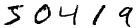

Introduction tutorial
=====================

In this tutorial we will perform handwriting recognition by training a
`multilayer perceptron`_ (MLP) on the `MNIST handwritten digit database`_.

The Task
--------
MNIST is a dataset which consists of 70,000 handwritten digits. Each digit is a
grayscale image of 28 by 28 pixels. Our task is to classify each of the images
into one of the 10 categories representing the numbers from 0 to 9.

   Sample MNIST digits

The Model
---------
We will train a simple MLP with a single hidden layer that uses the rectifier_
activation function. Our output layer will consist of a softmax_ function with
10 units; one for each class. Mathematically speaking, our model is parametrized
by :math:`\mathbf{\theta}`, defined as the weight matrices
:math:`\mathbf{W}^{(1)}` and :math:`\mathbf{W}^{(2)}`, and bias vectors
:math:`\mathbf{b}^{(1)}` and :math:`\mathbf{b}^{(2)}`. The rectifier activation
function is defined as

.. math:: \mathrm{ReLU}(\mathbf{x})_i = \max(0, \mathbf{x}_i)

and our softmax output function is defined as

.. math:: \mathrm{softmax}(\mathbf{x})_i = \frac{e^{\mathbf{x}_i}}{\sum_{j=1}^n e^{\mathbf{x}_j}}

Hence, our complete model is

.. math:: f(\mathbf{x}; \mathbf{\theta}) = \mathrm{softmax}(\mathbf{W}^{(2)}\mathrm{ReLU}(\mathbf{W}^{(1)}\mathbf{x} + \mathbf{b}^{(1)}) + \mathbf{b}^{(2)})

Since the output of a softmax sums to 1, we can interpret it as a categorical
probability distribution: :math:`f(\mathbf{x})_c = \hat p(y = c \mid
\mathbf{x})`, where :math:`\mathbf{x}` is the 784-dimensional (28 × 28) input
and :math:`c \in \{0, ..., 9\}` one of the 10 classes. We can train the
parameters of our model by minimizing the negative log-likelihood i.e. the
cross-entropy between our model's output and the target distribution. This
means we will minimize the sum of

.. math:: l(\mathbf{f}(\mathbf{x}), y) = -\sum_{c=0}^9 \mathbf{1}_{(y=c)} \log f(\mathbf{x})_c = -\log f(\mathbf{x})_y

(where :math:`\mathbf{1}` is the indicator function) over all examples. We use
`stochastic gradient descent`_ (SGD) on mini-batches for this.

.. _model_building:

Building the model
------------------
Blocks uses "bricks" to build models. Bricks are **parametrized Theano 
operations**. You can read more about it in the 
:ref:`building with bricks <bricks>` tutorial.

Constructing the model with Blocks is very simple. We start by defining the
input variable using Theano.

.. tip::
   Want to follow along with the Python code? If you are using IPython, enable
   the `doctest mode`_ using the special ``%doctest_mode`` command so that you
   can copy-paste the examples below (including the ``>>>`` prompts) straight
   into the IPython interpreter.

>>> from theano import tensor
>>> x = tensor.matrix('features')

Note that we picked the name ``'features'`` for our input. This is important,
because the name needs to match the name of the data source we want to train on.
MNIST defines two data sources: ``'features'`` and ``'targets'``.

For the sake of this tutorial, we will go through building an MLP the long way.
For a much quicker way, skip right to the end of the next section. We begin
with applying the linear transformations and activations.

We start by initializing bricks with certain parameters e.g. ``input_dim``.
After initialization we can apply our bricks on Theano variables to build the model
we want. We'll talk more about bricks in the next tutorial, :doc:`bricks_overview`.

>>> from blocks.bricks import Linear, Rectifier, Softmax
>>> input_to_hidden = Linear(name='input_to_hidden', input_dim=784, output_dim=100)
>>> h = Rectifier().apply(input_to_hidden.apply(x))
>>> hidden_to_output = Linear(name='hidden_to_output', input_dim=100, output_dim=10)
>>> y_hat = Softmax().apply(hidden_to_output.apply(h))

Loss function and regularization
--------------------------------
Now that we have built our model, let's define the cost to minimize. For this,
we will need the Theano variable representing the target labels.

>>> y = tensor.lmatrix('targets')
>>> from blocks.bricks.cost import CategoricalCrossEntropy
>>> cost = CategoricalCrossEntropy().apply(y.flatten(), y_hat)

To reduce the risk of overfitting, we can penalize excessive values of
the parameters by adding a :math:`L2`-regularization term (also known as
*weight decay*) to the objective function:

.. math:: l(\mathbf{f}(\mathbf{x}), y) = -\log f(\mathbf{x})_y + \lambda_1\|\mathbf{W}^{(1)}\|^2 + \lambda_2\|\mathbf{W}^{(2)}\|^2

To get the weights from our model, we will use Blocks' annotation features (read
more about them in the :doc:`cg` tutorial).

>>> from blocks.roles import WEIGHT
>>> from blocks.graph import ComputationGraph
>>> from blocks.filter import VariableFilter
>>> cg = ComputationGraph(cost)
>>> W1, W2 = VariableFilter(roles=[WEIGHT])(cg.variables)
>>> cost = cost + 0.005 * (W1 ** 2).sum() + 0.005 * (W2 ** 2).sum()
>>> cost.name = 'cost_with_regularization'

.. note::

   Note that we explicitly gave our variable a name. We do this so that when we
   monitor the performance of our model, the progress monitor will know what
   name to report in the logs.

Here we set :math:`\lambda_1 = \lambda_2 = 0.005`. And that's it! We now have
the final objective function we want to optimize.

But creating a simple MLP this way is rather cumbersome. In practice, we would
have used the :class:`.MLP` class instead.

>>> from blocks.bricks import MLP
>>> mlp = MLP(activations=[Rectifier(), Softmax()], dims=[784, 100, 10]).apply(x)

Initializing the parameters
---------------------------
When we constructed the :class:`.Linear` bricks to build our
model, they automatically allocated Theano shared variables to store their
parameters in.  All of these parameters were initially set to ``NaN``. Before 
we start training our network, we will want to initialize these parameters 
by sampling them from a particular probability distribution. Bricks can do this 
for you.

>>> from blocks.initialization import IsotropicGaussian, Constant
>>> input_to_hidden.weights_init = hidden_to_output.weights_init = IsotropicGaussian(0.01)
>>> input_to_hidden.biases_init = hidden_to_output.biases_init = Constant(0)
>>> input_to_hidden.initialize()
>>> hidden_to_output.initialize()

We have now initialized our weight matrices with entries drawn from a normal
distribution with a standard deviation of 0.01.

>>> W1.get_value() # doctest: +SKIP
        array([[ 0.01624345, -0.00611756, -0.00528172, ...,  0.00043597, ...

Training your model
-------------------
Besides helping you build models, Blocks also provides the main other features
needed to train a model. It has a set of training algorithms (like SGD), an
interface to datasets, and a training loop that allows you to monitor and
control the training process.

We want to train our model on the training set of MNIST. We load the data using
the Fuel_ framework. Have a look at `this tutorial`_ to get started.

After having configured Fuel, you can load the dataset.

>>> from fuel.datasets import MNIST
>>> mnist = MNIST(("train",))

Datasets only provide an interface to the data. For actual training, we will
need to iterate over the data in minibatches. This is done by initiating a data
stream which makes use of a particular iteration scheme. We will use an
iteration scheme that iterates over our MNIST examples sequentially in batches
of size 256.

>>> from fuel.streams import DataStream
>>> from fuel.schemes import SequentialScheme
>>> from fuel.transformers import Flatten
>>> data_stream = Flatten(DataStream.default_stream(
...     mnist,
...     iteration_scheme=SequentialScheme(mnist.num_examples, batch_size=256)))

The training algorithm we will use is straightforward SGD with a fixed
learning rate.

>>> from blocks.algorithms import GradientDescent, Scale
>>> algorithm = GradientDescent(cost=cost, parameters=cg.parameters,
...                             step_rule=Scale(learning_rate=0.1))

During training we will want to monitor the performance of our model on
a separate set of examples. Let's create a new data stream for that.

>>> mnist_test = MNIST(("test",))
>>> data_stream_test = Flatten(DataStream.default_stream(
...     mnist_test,
...     iteration_scheme=SequentialScheme(
...         mnist_test.num_examples, batch_size=1024)))

In order to monitor our performance on this data stream during training, we need
to use one of Blocks' extensions, namely the :class:`.DataStreamMonitoring`
extension.

>>> from blocks.extensions.monitoring import DataStreamMonitoring
>>> monitor = DataStreamMonitoring(
...     variables=[cost], data_stream=data_stream_test, prefix="test")

We can now use the :class:`.MainLoop` to combine all the different
bits and pieces. We use two more extensions to make our training stop after
a single epoch and to make sure that our progress is printed.

>>> from blocks.main_loop import MainLoop
>>> from blocks.extensions import FinishAfter, Printing
>>> main_loop = MainLoop(data_stream=data_stream, algorithm=algorithm,
...                      extensions=[monitor, FinishAfter(after_n_epochs=1), Printing()])
>>> main_loop.run() # doctest: +SKIP
<BLANKLINE>
-------------------------------------------------------------------------------
BEFORE FIRST EPOCH
-------------------------------------------------------------------------------
Training status:
     epochs_done: 0
     iterations_done: 0
Log records from the iteration 0:
     test_cost_with_regularization: 2.34244632721
<BLANKLINE>
<BLANKLINE>
-------------------------------------------------------------------------------
AFTER ANOTHER EPOCH
-------------------------------------------------------------------------------
Training status:
     epochs_done: 1
     iterations_done: 235
Log records from the iteration 235:
     test_cost_with_regularization: 0.664899230003
     training_finish_requested: True
<BLANKLINE>
<BLANKLINE>
-------------------------------------------------------------------------------
TRAINING HAS BEEN FINISHED:
-------------------------------------------------------------------------------
Training status:
     epochs_done: 1
     iterations_done: 235
Log records from the iteration 235:
     test_cost_with_regularization: 0.664899230003
     training_finish_requested: True
     training_finished: True
<BLANKLINE>

.. _multilayer perceptron: https://en.wikipedia.org/wiki/Multilayer_perceptron
.. _MNIST handwritten digit database: http://yann.lecun.com/exdb/mnist/
.. _rectifier: https://en.wikipedia.org/wiki/Rectifier_%28neural_networks%29
.. _softmax: https://en.wikipedia.org/wiki/Softmax_function
.. _stochastic gradient descent: https://en.wikipedia.org/wiki/Stochastic_gradient_descent
.. _doctest mode: http://ipython.org/ipython-doc/dev/interactive/tips.html#run-doctests
.. _download the MNIST files: http://yann.lecun.com/exdb/mnist/
.. _Fuel: http://fuel.readthedocs.org/en/latest/
.. _this tutorial: https://fuel.readthedocs.org/en/latest/built_in_datasets.html
